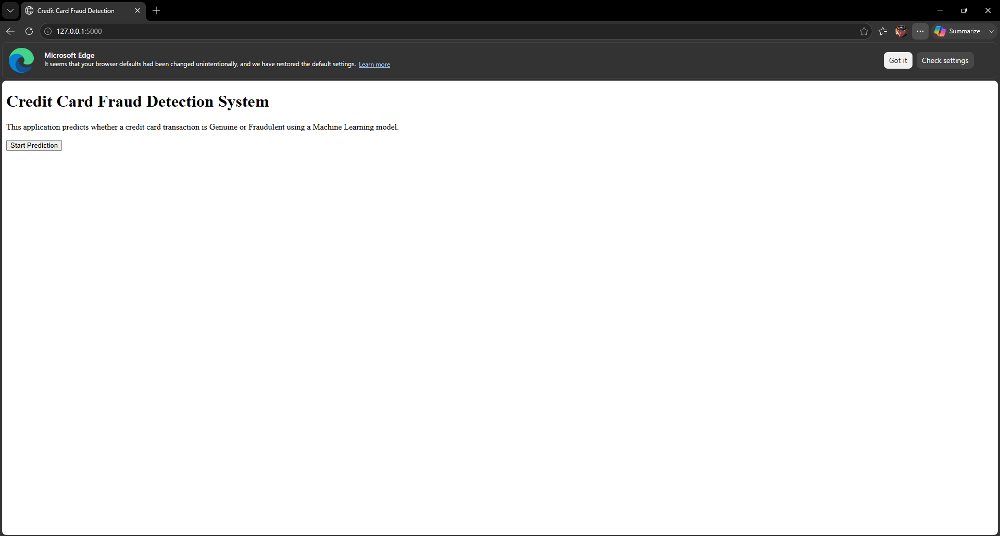
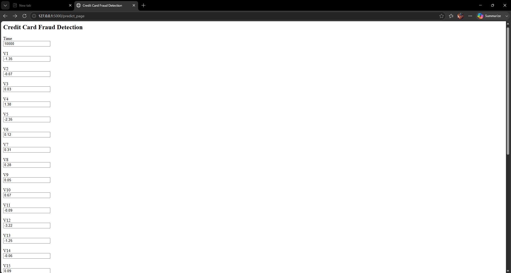
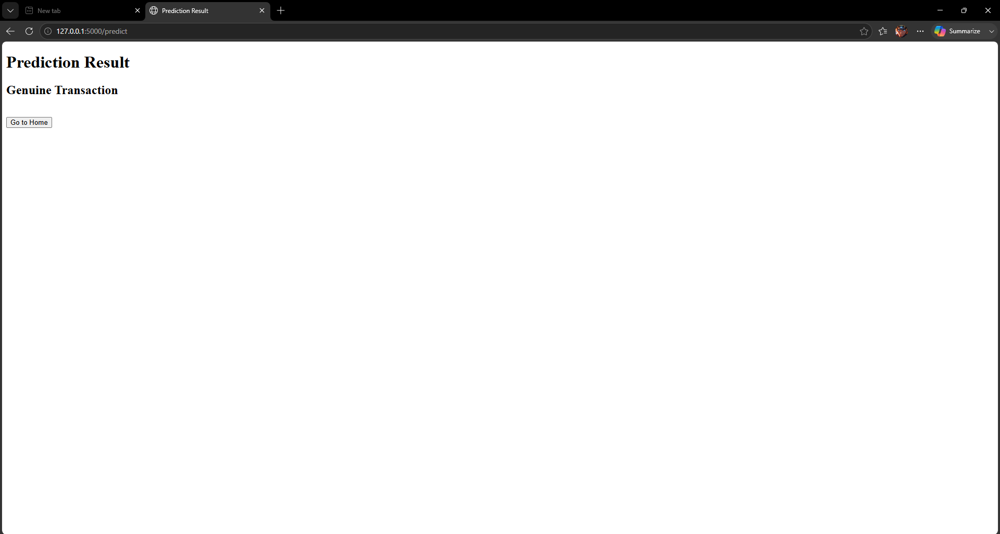

# Credit Card Fraud Detection Using Machine Learning

## 📌 Project Overview

This project is developed as part of the **APSCHE AI & ML Internship**.

The objective of this project is to detect fraudulent credit card transactions using Machine Learning algorithms. Multiple classification models are trained and evaluated to identify fraudulent transactions. The best-performing model is deployed using Flask to provide predictions through a web interface.

---

## 🎯 Project Objectives

- Load and analyze the credit card transaction dataset.
- Perform data preprocessing.
- Visualize transaction patterns.
- Train multiple Machine Learning models.
- Compare model performance.
- Deploy the trained model using Flask.

---

## 🛠 Technologies Used

- Python
- Pandas
- NumPy
- Matplotlib
- Seaborn
- Scikit-learn
- XGBoost
- Flask
- Pickle

---

## 📂 Dataset

**Dataset Name:**

Credit Card Fraud Detection Dataset

Source:

https://www.kaggle.com/datasets/mlg-ulb/creditcardfraud

---

## 🤖 Machine Learning Models

- Logistic Regression
- Decision Tree Classifier
- Random Forest Classifier
- XGBoost Classifier

---

## 📊 Project Workflow

1. Data Collection
2. Data Visualization
3. Data Preprocessing
4. Model Training
5. Model Evaluation
6. Model Deployment using Flask

---

## 💻 Project Structure

```
Credit_Card_Approval_Prediction/
│
├── app.py
├── model.pkl
├── creditcard.csv
├── Credit_Card_Approval_Prediction.ipynb
├── README.md
├── requirements.txt
│
├── templates/
│   ├── home.html
│   ├── index.html
│   └── result.html
│
└── static/
```

---

## 🚀 Running the Project

Clone the repository

```
git clone <repository-url>
```

Install dependencies

```
pip install -r requirements.txt
```

Run the Flask application

```
python app.py
```

Open the browser

```
http://127.0.0.1:5000
```

---

## 📷 Project Output

The web application predicts whether a transaction is:

- Genuine Transaction
- Fraudulent Transaction

---


## 📷 Project Working

### Home Page



---

### Prediction Page



---

### Prediction Result



---

## 👨‍🎓 Internship

APSCHE – AI & ML Internship

---

## 👤 Developed By

P. Vineeth Kumar
S. Visaal

Student

APSCHE AI & ML Internship